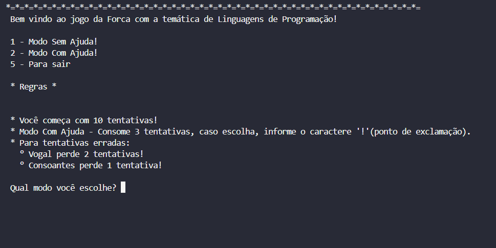
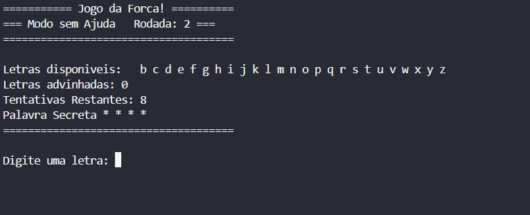

<h1 align="center">Jogo da Forca - Linguagens de Programação</h1>

  Um Jogo da Forca com temática de tecnologia, desenvolvido em Python para a matéria de Estrutura de Dados. O objetivo é adivinhar o nome de linguagens de programação.

<h2>🚀 Funcionalidades</h2>
<ul>
  <li><b>Dois Modos de Jogo:</b> Normal e Com Ajuda (revela uma letra ao custo de 3 tentativas).</li>
  <li><b>Penalidade Estratégica:</b> Errar uma vogal custa 2 tentativas; errar uma consoante custa 1.</li>
  <li><b>Sistema de Pontuação:</b> A pontuação final é calculada com base nas tentativas restantes e na complexidade da palavra.</li>
  <li><b>Interface Limpa:</b> O terminal é atualizado a cada rodada para uma melhor visualização.</li>
</ul>

<h2>⚙️ Como Executar</h2>
<ol>
  <li>Certifique-se de ter o <strong>Python 3</strong> instalado.</li>
  <li>Clone o repositório ou baixe o arquivo <code>forca.py</code>.</li>
  <li>No terminal, navegue até a pasta do projeto e execute:</li>
</ol>
<pre><code>python forca.py</code></pre>

<h2>📸 Imagens</h2>

  <h3>Menu Principal</h3>
  
    
  <h3>Gameplay</h3>
  

<h2>🛠️ Tecnologia</h2>
<ul>
  <li><strong>Python 3</strong> (apenas bibliotecas padrão)</li>
</ul>

<h2>👨‍💻 Desenvolvedor</h2>

  <strong>Luciano Simas Junior</strong>

